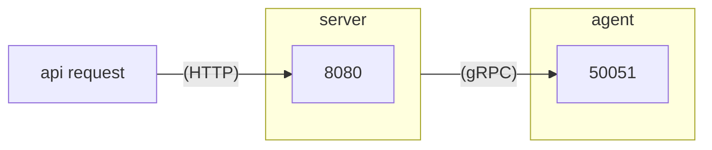

## gRPC Sample code (go)


- 구조



- 프로젝트 구조
```
.
├── Makefile
├── README.md
├── agent
│   ├── agent.go
│   ├── agent.proto
│   ├── agentpb
│   │   ├── agent.pb.go
│   │   └── agent_grpc.pb.go
│   ├── go.mod
│   └── go.sum
├── cmd
│   └── main.go
├── go.mod
├── go.sum
└── server
    ├── go.mod
    ├── go.sum
    └── server.go
```

- pb 코드 생성
```sh
make generate
```

- tidy
```sh
make tidy
```

- 실행
```sh
cd cmd
go run main.py
```

- 테스트
```sh
# AnotherFunction
curl -X POST "http://localhost:8080/execute" \
-H "Content-Type: application/json" \
-d '{"function_name": "AnotherFunction", "payload": "Hello"}' 

# TestFunction
curl -X POST "http://localhost:8080/execute" \
-H "Content-Type: application/json" \
-d '{"function_name": "TestFunction", "payload": "Hello"}'
```

